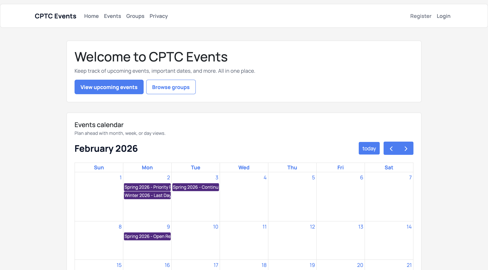
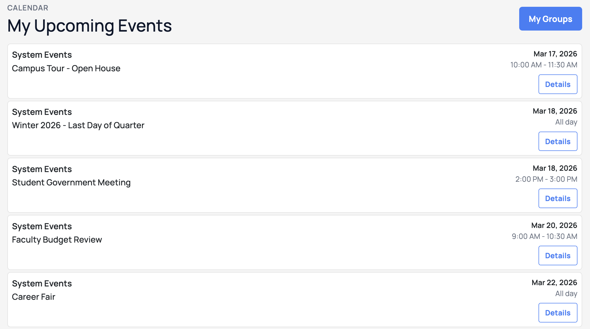
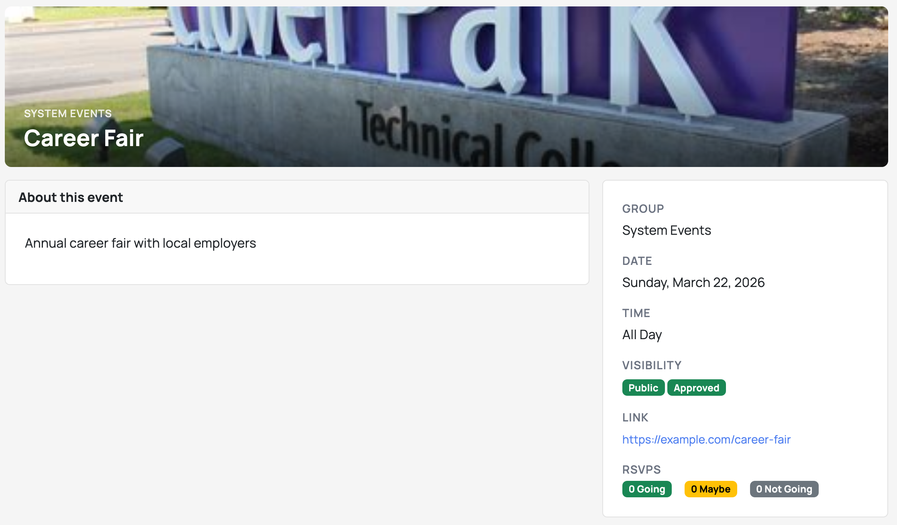
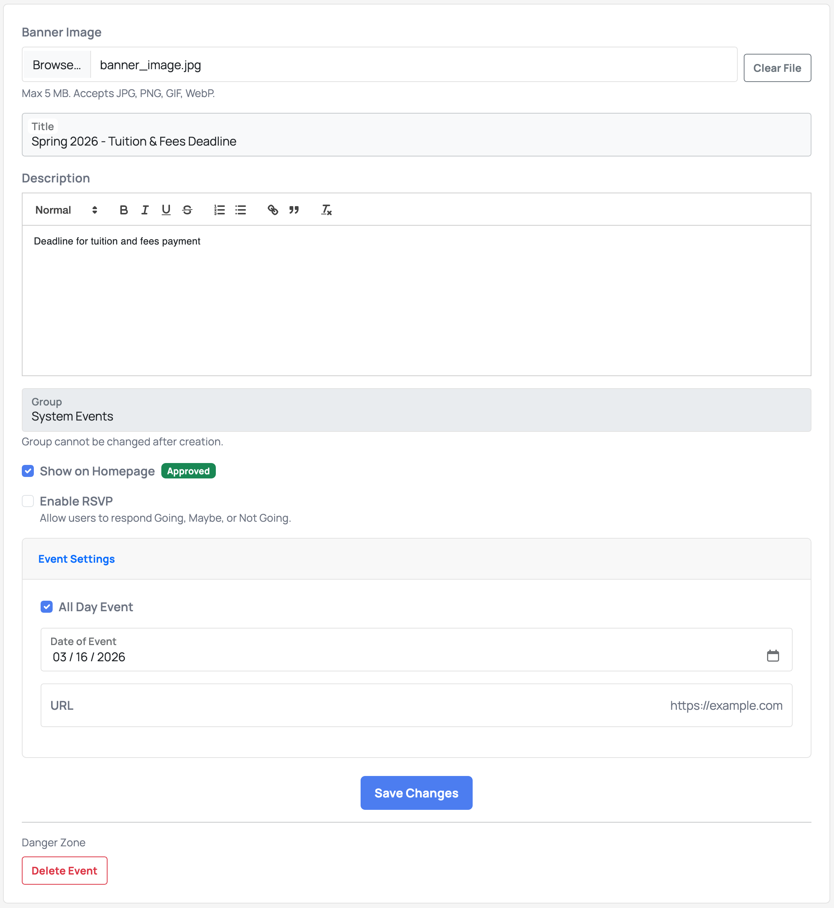

# CptcEvents

## Overview

An event management web application for Clover Park Technical College. Students, staff, and community members can discover, create, and manage campus events through an interactive calendar. The platform supports group-based event organization, role-based access control, admin features, and email integration via SendGrid.

## Features

### Event Management
- Interactive calendar
- Create, edit, and delete events
- Public events for the community, private events for groups
- RSVP tracking (Attending, Maybe, Not Attending)
- Admin approval system for homepage events

### Groups
- Create groups for classes, clubs, departments, or interests
- Role-based permissions: Owner, Moderator, and Member
- Invite members using invite codes (targeted or general, with configurable expiration time and usage limits)
- Dedicated calendar for each group

### Authentication
- ASP.NET Core Identity
- Special instructor registration codes
- Custom authorization policies for group roles

### Admin Dashboard
- Approve or deny public event requests
- Manage instructor registration codes

### Email
- SendGrid integration for email delivery
- Account confirmation emails

## Tech Stack

### Backend
- **Framework**: ASP.NET Core 10.0 (MVC)
- **Language**: C# 13
- **ORM**: Entity Framework Core 10.0 with automatic migrations
- **Authentication**: ASP.NET Core Identity
- **Authorization**: Policy-based with custom requirements and handlers

### Frontend
- **Template Engine**: Razor Views (MVC pattern)
- **CSS Framework**: Bootstrap 5
- **JavaScript**: FullCalendar interactive calendar

### Database & Infrastructure
- **Development**: SQL Server 2022 (Docker)
- **Production**: SQL Server 2022 (Docker, self-hosted)
- **Hosting**: Self-hosted server with Docker containers
- **CDN/Tunnel**: Cloudflare Tunnel (public access via `cptcevents.org`)
- **File Storage**: Azure Blob Storage
- **CI/CD**: GitHub Actions (self-hosted runner)

See [DEPLOYMENT.md](docs/DEPLOYMENT.md) for complete infrastructure details.

## Get Started

```bash
# Clone the repository
git clone https://github.com/aiden-richard/CptcEvents.git
cd CptcEvents

# Create the Docker network (once)
docker network create CptcEventsNetwork

# Start SQL Server and Azurite Blob Storage with Docker Compose
cd DevServices
docker compose up -d

# Run the application (migrations run automatically)
cd ../CptcEvents
dotnet run
```

Open http://localhost:5000 (or https://localhost:7274 with the HTTPS profile) and log in with `admin@cptc.edu` / `CptcDev123!`

See [DEVELOPMENT.md](docs/DEVELOPMENT.md) for detailed setup instructions.

## Deployment

GitHub Actions handles CI/CD with build validation on pull requests and automatic deployment to self-hosted server.

See [DEPLOYMENT.md](docs/DEPLOYMENT.md) for infrastructure details.

## Project Structure

```
CptcEvents/
├── Application/
│   └── Mappers/
├── Areas/
│   └── Identity/
├── Authorization/
│   ├── Handlers/
│   └── Requirements/
├── Controllers/
├── Data/
├── Migrations/
├── Models/
├── Services/
├── ViewComponents/
├── Views/
└── wwwroot/

DevServices/
docs/
deploy/
```

## Documentation

- [DEVELOPMENT.md](docs/DEVELOPMENT.md) - Local setup and troubleshooting
- [DEPLOYMENT.md](docs/DEPLOYMENT.md) - Infrastructure and CI/CD
- [docs/analysis/](docs/analysis/) - Class work done for CPW 207 - Object Oriented Analysis and Design

## Screenshots

### Homepage: [cptcevents.org](https://cptcevents.org)


### Upcoming Events


### Viewing an Event


### Editing an Event


## License

See [LICENSE.txt](LICENSE.txt)

---

#### Built for Clover Park Technical College
