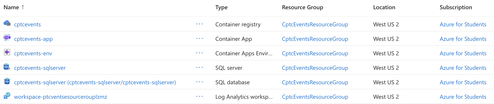

# CptcEvents Deployment Documentation

## Overview

This document describes the complete deployment process for the CptcEvents application, including Azure infrastructure setup and CI/CD pipeline configuration using GitHub Actions.

## Architecture

- **Application**: ASP.NET Core 10.0 web application
- **Database**: Azure SQL Database (SQL Server)
- **Container Registry**: Azure Container Registry (ACR)
- **Hosting**: Azure Container Apps
- **CI/CD**: GitHub Actions
- **Email Service**: SendGrid
- **Secrets Management**: GitHub Secrets

## Prerequisites

- Azure subscription with appropriate permissions
- Azure CLI installed locally
- .NET 10 SDK installed
- GitHub account with repository access
- SendGrid account with API key

## Azure Infrastructure Setup

All Azure resources were created using the Azure Portal web interface. Below are the resources that need to be provisioned and their purposes. The below screenshot shows every resource that needs to be created, either manually by us, or automatically through our workflow. (The Container App deployment is done by our workflow)



### 1. Resource Group

**Purpose**: A logical container that groups all related Azure resources together for easier management, billing, and access control.

**Configuration**:
- Name: `CptcEventsResourceGroup`
- Location: `westus2` (or your preferred region)

**Why**: Keeping all resources in one resource group simplifies management, allows bulk operations, and provides clear cost tracking for the entire application.

### 2. Azure SQL Database

**Purpose**: Provides a managed, scalable relational database service for storing application data. Replaced SQLite to support production workloads and enable Entity Framework Core migrations with SQL Server.

**Configuration**:
- **SQL Server**: Create a new logical server with admin credentials
  - Server name: `cptcevents-sqlserver` (or similar)
  - Authentication: SQL authentication with secure admin password. `cptcadmin` is the admin user for us.
- **Database**: Create a database on the server
  - Database name: `cptcevents-sqlserver` (same as our server)
  - Service tier: Free - General Purpose - Serverless: Gen5, 2 vCores (Obtained for free via a Student Discount)
- **Firewall Rules**: Configure network access
  - Allow Azure services: Enables Container Apps to connect
  - Add local IP: Allows local development and testing

**Why**: Azure SQL provides automatic backups, high availability, security features, and eliminates the need to manage database infrastructure.

**Connection String Format**:
```
Server=tcp:cptcevents-sqlserver.database.windows.net,1433;Initial Catalog=cptcevents-sqlserver;Persist Security Info=False;User ID=cptcadmin;Password={your_password};MultipleActiveResultSets=False;Encrypt=True;TrustServerCertificate=False;Connection Timeout=30;
```

### 3. Azure Container Registry

**Purpose**: A private Docker registry for storing and managing container images. This is where your built application images are stored before deployment.

**Configuration**:
- Name: `cptcevents` (Azure auto-generates full name like `cptcevents-fbh7bqh0f6a6hpgt`)
- SKU: Basic - sufficient for CI/CD workflows
- Admin access: Enabled to allow GitHub Actions to push/pull images

**Why**: ACR provides secure, private storage for container images with integration into Azure services. It enables the CI/CD pipeline to push images that Container Apps can then deploy. The Basic tier is cost-effective for single-application scenarios.

### 4. Azure Container Apps Environment

**Purpose**: Provides the underlying infrastructure and configuration for running containerized applications with built-in features like auto-scaling, load balancing, and HTTPS termination.

**Configuration**:
- Environment name: `cptcevents-env`
- Location: Same as resource group
- Creates the compute and networking foundation for Container Apps

**Why**: Container Apps abstracts away infrastructure management while providing enterprise features. The environment can host multiple container apps and handles networking, scaling, and monitoring automatically.

### 5. Azure Service Principal (for GitHub Actions)

**Purpose**: Provides authentication credentials that GitHub Actions uses to authenticate with Azure and perform deployments. A service principal is a non-human identity with specific permissions.

**How to Create**:
Run the following Azure CLI command (replace `{subscription-id}` with your actual subscription ID):

```bash
az ad sp create-for-rbac --name "cptcevents-github" --role contributor --scopes /subscriptions/{subscription-id}/resourceGroups/CptcEventsResourceGroup --sdk-auth
```

**Important Notes**:
- The `--sdk-auth` flag is **required** to generate the correct JSON format for GitHub Actions
- Save the entire JSON output - you'll need it for the `AZURE_CREDENTIALS` GitHub Secret
- The output includes: clientId, clientSecret, subscriptionId, tenantId, and other required fields
- This service principal has Contributor access scoped to only the CptcEventsResourceGroup

**Why**: Service principals follow security best practices by providing limited, scoped access rather than using personal credentials. This allows automated deployments while maintaining security and audit trails.

### 6. Cost Management Setup

**Purpose**: Monitors Azure spending and sends alerts when costs exceed thresholds, preventing unexpected charges.

**Configuration**:
- Budget name: `CptcEventsBudget`
- Amount: $20 per month
- Alert threshold: 85% of budget (~$17)
- Notification sent to: Your email address and optionally phone number as a text message

**Why**: Azure services bill based on usage, and costs can escalate if resources aren't monitored. Budget alerts provide early warning before spending exceeds expectations, allowing you to take action before the billing period ends.

## GitHub Secrets Configuration

Navigate to your GitHub repository → Settings → Secrets and variables → Actions, and add the following secrets:

| Secret Name | Description | How to Obtain |
|------------|-------------|---------------|
| `AZURE_CREDENTIALS` | Azure service principal credentials in SDK auth format | Run: `az ad sp create-for-rbac --name "cptcevents-github" --role contributor --scopes /subscriptions/{subscription-id}/resourceGroups/CptcEventsResourceGroup --sdk-auth` (Note: the `--sdk-auth` flag is required for the correct JSON format) |
| `ACR_PASSWORD` | Azure Container Registry password | Azure Portal → Container Registry → Access keys → password, or run: `az acr credential show --name cptcevents` |
| `SQL_CONNECTION_STRING` | Azure SQL Database connection string | Azure Portal → SQL Database → Connection strings → ADO.NET |
| `SENDGRID_API_KEY` | SendGrid API key for email sending | SendGrid dashboard → Settings → API Keys |
| `ADMIN_PASSWORD` | Initial admin user password | Choose a secure password (used for initial admin account setup) |

## CI/CD Pipeline

### GitHub Actions Workflows

The project uses two separate GitHub Actions workflows to handle different scenarios:

#### 1. Build Workflow (`.github/workflows/build.yml`)

**Trigger**: Runs on pull requests to `main` branch

**Purpose**: Validates that code changes compile and pass tests before merging. This ensures the main branch remains stable by catching build errors early in the development process.

**Steps**:
- Checkout code
- Install .NET 10 Preview SDK
- Restore dependencies
- Build application in Release configuration
- Run tests (continues even if no tests exist)

**Why Separate**: This workflow is lightweight and fast, providing quick feedback to developers without the overhead of Docker builds or Azure deployments. It prevents broken code from being merged into main.

#### 2. Deploy Workflow (`.github/workflows/deploy.yml`)

**Trigger**: Runs automatically on pushes to `main` branch

**Purpose**: Builds the application, creates a Docker image, and deploys to Azure Container Apps. This workflow handles the complete CI/CD pipeline for production deployments.

#### Deployment Pipeline Stages

1. **Checkout Code**
   - Pulls the latest code from the main branch

2. **Install .NET 10 Preview SDK**
   - Downloads and installs .NET 10.0.100-rc.2.25502.107
   - Configures environment paths

3. **Build Application**
   - Restores NuGet dependencies
   - Builds the application in Release configuration

4. **Azure Authentication**
   - Logs into Azure using `AZURE_CREDENTIALS` secret
   - Authenticates with personal Azure account credentials

5. **Container Registry Login**
   - Authenticates with Azure Container Registry
   - Uses Azure CLI credentials from previous step

6. **Build and Push Docker Image**
   - Builds Docker image with multi-stage build (SDK → Runtime)
   - Tags image with both commit SHA and `latest`
   - Pushes both tags to ACR at `cptcevents-fbh7bqh0f6a6hpgt.azurecr.io`

7. **Deploy to Azure Container Apps**
   - Creates or updates Container App with latest image
   - Connects to ACR using `ACR_PASSWORD` secret
   - Injects environment variables from secrets:
     - `SQL_CONNECTION_STRING` → ConnectionStrings__DefaultConnection
     - `SENDGRID_API_KEY` → SendGrid__ApiKey
     - `ADMIN_PASSWORD` → AdminUser__Password
   - Sets up external ingress on port 8080

### Dockerfile Details

The application uses a multi-stage Docker build:

```dockerfile
# Stage 1: Build (SDK image)
FROM mcr.microsoft.com/dotnet/sdk:10.0@sha256:d1823fecac3689a2eb959e02ee3bfe1c2142392808240039097ad70644566190 AS build
WORKDIR /App

# Copy csproj
COPY *.csproj ./
# Restore as distinct layers
RUN dotnet restore
# Build and publish a release
RUN dotnet publish -o out

# Stage 2: Runtime (ASP.NET image)
FROM mcr.microsoft.com/dotnet/aspnet:10.0@sha256:eaa79205c3ade4792a7f7bf310a3aac51fe0e1d91c44e40f70b7c6423d475fe0
WORKDIR /App
COPY --from=build /App/out .

ENTRYPOINT ["dotnet", "CptcEvents.dll"]
```

**How It Works:**

The Dockerfile uses a **multi-stage build** pattern with optimizations:

1. **Build Stage**: Uses the SHA-pinned .NET SDK image for reproducible builds
   - Copies only `.csproj` file first for optimal Docker layer caching
   - Restores NuGet packages as a separate layer (`dotnet restore`)
   - Copies remaining source code (implicitly done during publish)
   - Compiles and publishes the application to the `out` directory (`dotnet publish`)
   - The SDK image is large (~1GB) but only used during build

2. **Runtime Stage**: Uses the lightweight SHA-pinned ASP.NET runtime image
   - Creates a fresh container based on the ASP.NET runtime (not the SDK)
   - Copies only the published binaries from the build stage (`COPY --from=build`)
   - Sets the entry point to run the compiled application

**Optimizations**:
- **SHA-pinned base images**: Ensures reproducible builds and security by using immutable image versions
- **Layer caching**: By copying `.csproj` before source code, NuGet restore only re-runs when dependencies change, not on every code change

**Result**: The final container image only contains the runtime components and your compiled application, not the entire SDK. This produces a smaller final image size (~200MB vs ~1GB) that's optimized for production deployment and faster container startup.

## Environment Configuration

### Production Environment Variables

The following environment variables are injected during deployment:

- `ASPNETCORE_ENVIRONMENT=Production`
- `ConnectionStrings__DefaultConnection` - Azure SQL connection string
- `SendGrid__ApiKey` - SendGrid API key
- `AdminUser__Password` - Admin user password

## Database Migrations

### Initial Setup

Ensure that your SQL database in azure is running and that your connection string is properly loaded from user secrets. Then run the following command:

```bash
dotnet ef database update
```

### Migration Strategy

**Current Approach**: Migrations are applied automatically on application startup in `Program.cs` by running `await context.Database.MigrateAsync();`.

## Local Development Setup

### 1. Clone Repository

```bash
git clone https://github.com/your-username/CptcEvents.git
cd CptcEvents
```

### 2. Configure User Secrets

```bash
cd CptcEvents
dotnet user-secrets init
dotnet user-secrets set "ConnectionStrings:DefaultConnection" "<local-or-azure-connection-string>"
dotnet user-secrets set "SendGrid:ApiKey" "<sendgrid-api-key>"
dotnet user-secrets set "AdminUser:Password" "<admin-password>"
```

### 3. Run Migrations

```bash
dotnet ef database update
```

### 4. Run Application

```bash
dotnet run
```

Application will be available at `http://localhost:5000`. (Port number is set in `/CptcEvents/Properties/launchSetting.json`)

## Deployment Process

### Automated Deployment

#### Pull Request Workflow

1. Create a feature branch and make changes
2. Push branch and create a pull request to `main`
3. The Build workflow automatically runs to validate:
   - Code compiles successfully
   - All dependencies resolve
   - Tests pass (if they exist)
4. Review the build status in the pull request checks
5. Merge only when the build workflow succeeds

#### Main Branch Deployment

1. After merging to `main` (or pushing directly):
   ```bash
   git add .
   git commit -m "Description of changes"
   git push origin main
   ```
2. The Deploy workflow automatically:
   - Builds the application
   - Creates Docker image
   - Pushes to ACR
   - Deploys to Azure Container Apps
3. Monitor deployment in GitHub Actions tab

The build workflow takes approximately 2-3 minutes. The full deployment process takes approximately 5-10 minutes from push to live deployment.

### Manual Deployment via Azure Portal

If needed, you can trigger a deployment manually through the Azure Portal:

1. **Update Container Image**:
   - Navigate to your Container App in Azure Portal
   - Go to "Containers" section
   - Select "Edit and deploy" 
   - Choose new image tag from your ACR
   - Click "Deploy"

2. **Restart Container App**:
   - Go to "Overview" page
   - Click "Restart" to pick up new environment variable changes

**Why Manual Deployment?**: Useful for troubleshooting, testing specific image versions, or when GitHub Actions is unavailable.

## Monitoring and Troubleshooting

### View Application Logs

**Location**: Azure Portal → Container App → Monitoring → Log stream

**Purpose**: View real-time application logs, including startup messages, errors, and request information. This is essential for diagnosing issues and understanding application behavior in production.

**What to Look For**:
- Application startup messages
- Database connection status
- HTTP request logs
- Exception stack traces
- Custom logging output

### Check Container App Status

**Location**: Azure Portal → Container App → Overview

**Key Metrics**:
- **Running Status**: Shows if the app is running, provisioning, or stopped
- **Replica Count**: Number of active container instances
- **CPU/Memory Usage**: Resource consumption metrics
- **HTTP Requests**: Traffic patterns and response times

**Purpose**: Quickly verify the health of your deployment and identify performance issues.

## Rollback Procedures

### Rollback to Previous Version

**Purpose**: Restore a previous working version of the application if a deployment introduces bugs or issues.

**Process**:
1. Go to Azure Container Registry → Repositories → cptcevents
2. View all available image tags (sorted by push time)
3. Find the previous version by commit SHA or timestamp
4. Go to Container App → Containers → Edit and deploy
5. Update the image tag to the previous version
6. Deploy the change

**Why This Works**: Every deployment creates a Docker image tagged with the Git commit SHA. This provides an immutable history of all deployed versions that can be restored at any time.

### Database Rollback

**Purpose**: Revert database schema changes if a migration causes issues.

**Process**:
1. Identify the target migration to rollback to (check Migrations folder)
2. Temporarily set environment variable with production connection string locally
3. Run Entity Framework rollback to specific migration
4. Restart the Container App to prevent automatic re-migration

**Caution**: Database rollbacks can cause data loss if the migration being reverted removed columns or tables. Always backup the database before rolling back migrations.

4. **Access Control**
   - Use Azure RBAC for resource access
   - Limit service principal permissions to specific resource group
   - Enable Azure AD authentication for SQL Server

## Estimated Costs

| Resource | SKU | Estimated Monthly Cost (USD) |
|----------|-----|------------------------------|
| Azure SQL Database | General Purpose - Serverless: Gen5, 2 vCores | **$0** (Azure for Students) |
| Azure Container Registry | Basic | ~$5 |
| Azure Container Apps | Consumption | ~$5-15 (usage-based) |
| **Total** | | **~$10-20/month** |

**Note**: The SQL Database cost is waived through the Azure for Students program. Without this discount, a comparable SQL Database would cost approximately $15-30/month depending on configuration.

## Common Issues

### 1. Database Connection Failures

**Symptoms**: Application crashes or returns 500 errors

**Solutions**:
- Verify firewall rules allow Azure services (check SQL Server → Networking in portal)
- Check connection string is correct in GitHub Secrets
- Confirm SQL Server is running (should show "Available" in portal)
- Test connection using Azure Portal's Query Editor in the SQL Database page

### 2. Container Won't Start

**Symptoms**: Container App shows "Provisioning" state indefinitely

**Solutions**:
- Check logs in Container App → Log stream for startup errors
- Verify all required environment variables are set in Container App → Environment variables
- Ensure ACR credentials are correct in Container App → Containers settings
- Check that the image actually exists in ACR → Repositories

### 3. Deployment Timeout

**Symptoms**: GitHub Actions deployment step times out or hangs

**Solutions**:
- Check Container Apps environment status in Azure Portal
- Verify ACR is accessible from Container Apps (check networking/firewall)
- Review GitHub Actions logs for specific error messages
- Check if Container App needs to be recreated (delete and redeploy)

## Additional Resources

- [Azure Container Apps Documentation](https://learn.microsoft.com/en-us/azure/container-apps/)
- [Entity Framework Core Migrations](https://learn.microsoft.com/en-us/ef/core/managing-schemas/migrations/)
- [GitHub Actions Documentation](https://docs.github.com/en/actions)
- [.NET 10 Documentation](https://learn.microsoft.com/en-us/dotnet/)