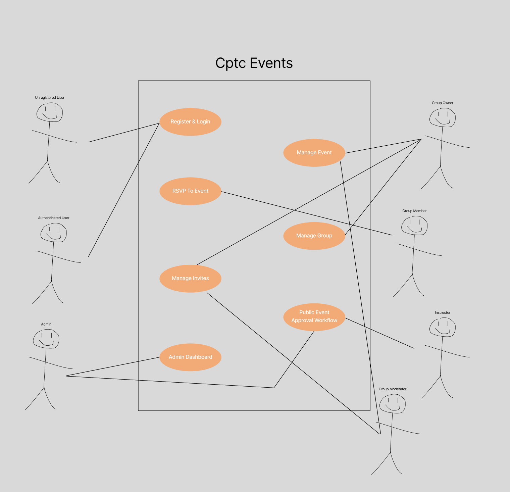

# Features and Use Cases

## Features
- Register and Login
- Event management
- Event RSVP tracking
- Group management
- Group invite system
- Public event approval workflow
- Admin dashboard

## Brief Use Cases

### UC1: Register for an account
- Primary Actor: Unregistered User
- Goal: Create a new student or instructor account

### UC2: Create a group
- Primary Actor: Authenticated User
- Goal: Create a new group to track events

### UC3: Join a group
- Primary Actor: Authenticated User
- Goal: Join a public group to view and interact with its events

### UC4: Invite a user to a group
- Primary Actor: Group Owner & Group Moderator (Depending on group privacy level)
- Goal: Create group invites so that another user can join as a group member

### UC5: Redeem a group invite
- Primary Actor: Authenticated User
- Goal: Use an invite code to join a group

### UC6: Manage group members
- Primary Actor: Group Owner
- Goal: Change member roles or remove members

### UC7: Create an event
- Primary Actor: Group Moderator
- Goal: Create a new event within a group

### UC8: RSVP to an event
- Primary Actor: Group Member
- Goal: Indicate attendance status for an upcoming event

### UC9: Request public event visibility
- Primary Actor: Instructor
- Goal: Flag an event as public so it can appear on the homepage after admin approval

### UC10: Approve or deny a public event
- Primary Actor: Admin
- Goal: Review pending public events and approve or deny them for homepage display

### UC11: Manage instructor registration codes
- Primary Actor: Admin
- Goal: Create or delete instructor codes so that instructors can register with the correct role

## Use Case Traceability

| Use Case | Feature(s) |
|---|---|
| UC1: Register for an account | Register and Login |
| UC2: Create a group | Group management |
| UC3: Join a group | Group management |
| UC4: Invite a user to a group | Group invite system |
| UC5: Redeem a group invite | Group invite system, Group management |
| UC6: Manage group members | Group management |
| UC7: Create an event | Event management |
| UC8: RSVP to an event | Event RSVP tracking |
| UC9: Request public event visibility | Event management, Public event approval workflow |
| UC10: Approve or deny a public event | Public event approval workflow, Admin dashboard |
| UC11: Manage instructor registration codes | Register and Login, Admin dashboard |

## Use Case Diagram
Include your diagram image below.

