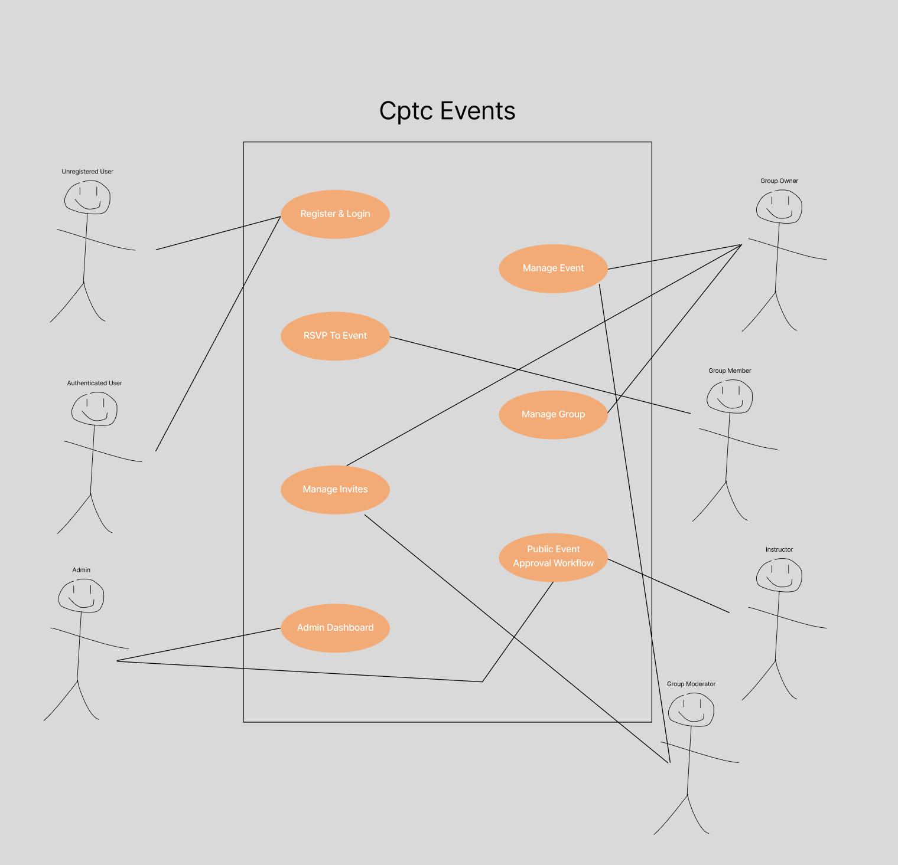

# Features and Use Cases

## Features
- Register and Login
- Event management
- Event RSVP tracking
- Group management
- Group invite system
- Public event approval workflow
- Admin dashboard

## Brief Use Cases

### UC1: Register for an account
- Primary Actor: Unregistered User
- Goal: Create a new student or instructor account

### UC2: Create a group
- Primary Actor: Authenticated User
- Goal: Create a new group to track events

### UC3: Join a group
- Primary Actor: Authenticated User
- Goal: Join a public group to view and interact with its events

### UC4: Invite a user to a group
- Primary Actor: Group Owner & Group Moderator (Depending on group privacy level)
- Goal: Create group invites so that another user can join as a group member

### UC5: Redeem a group invite
- Primary Actor: Authenticated User
- Goal: Use an invite code to join a group

### UC6: Manage group members
- Primary Actor: Group Owner
- Goal: Change member roles or remove members

### UC7: Create an event
- Primary Actor: Group Moderator
- Goal: Create a new event within a group

### UC8: RSVP to an event
- Primary Actor: Group Member
- Goal: Indicate attendance status for an upcoming event

### UC9: Request public event visibility
- Primary Actor: Instructor
- Goal: Flag an event as public so it can appear on the homepage after admin approval

### UC10: Approve or deny a public event
- Primary Actor: Admin
- Goal: Review pending public events and approve or deny them for homepage display

### UC11: Manage instructor registration codes
- Primary Actor: Admin
- Goal: Create or delete instructor codes so that instructors can register with the correct role

## Use Case Traceability

| Use Case | Feature(s) |
|---|---|
| UC1: Register for an account | Register and Login |
| UC2: Create a group | Group management |
| UC3: Join a group | Group management |
| UC4: Invite a user to a group | Group invite system |
| UC5: Redeem a group invite | Group invite system, Group management |
| UC6: Manage group members | Group management |
| UC7: Create an event | Event management |
| UC8: RSVP to an event | Event RSVP tracking |
| UC9: Request public event visibility | Event management, Public event approval workflow |
| UC10: Approve or deny a public event | Public event approval workflow, Admin dashboard |
| UC11: Manage instructor registration codes | Register and Login, Admin dashboard |

## Use Case Diagram

## Detailed Use Cases

### UC1: Register for an account
**Primary Actor:** Unregistered User 
**Goal:** Create a new student or instructor account so the user can access the system. 
**Preconditions:** The email address is not already associated with an existing account. 
**Success Outcome:** A new account is created with the appropriate role (Student or Instructor); the user is authenticated. 

**Main Flow**
1. User submits a registration form with email, first and last name, username, password, and optional instructor registration code.
2. System validates that the email is unique. Password is atleast 6 characters long.
3. System determines the role: if a valid instructor code was supplied, the role is Instructor; otherwise the role is Student.
4. System creates the account and marks the user as authenticated.

**Alternate Flow**
- A1: Email is already in use -> system rejects the request and reports a duplicate email error; no account is created.
- A2: Password does not match or is shorter than 6 characters -> system rejects the request and reports a validation error; no account is created.
- A3: Instructor code is supplied but invalid or already used -> system rejects the request and reports an invalid code error; no account is created.

---

### UC2: Create a group
**Primary Actor:** Authenticated User 
**Goal:** Create a new group. 
**Preconditions:** The user is authenticated. 
**Success Outcome:** A new group exists in the system; the user is recorded as its Owner. 

**Main Flow**
1. User submits a group creation request with a group name, description, a privacy level (Public or Private), Invite policy, and group color.
2. System validates that the group name is non-empty.
3. System creates the group and assigns the requesting user the Owner role within that group.

**Alternate Flow**
- A1: Group name is empty or exceeds maximum length -> system rejects the request and reports a validation error; no group is created.

---

### UC3: Join a group
**Primary Actor:** Authenticated User 
**Goal:** Become a member of an existing group. 
**Preconditions:** The user is authenticated; the target group exists and has a Public privacy level or the user has been invited; the user is not already a member of the group. 
**Success Outcome:** The user is recorded as a Member of the group and can view its events. 

**Main Flow**
1. User requests to join a specific public group.
2. System confirms the group is Public and the user is not already a member.
3. System adds the user as a Member of the group.

**Alternate Flow**
- A1: Group privacy level is Private -> system rejects the request; the user must use an invite to join.
- A2: User is already a member of the group -> system rejects the request and reports that membership already exists.

---

### UC4: Invite a user to a group
**Primary Actor:** Group Owner, Group Moderator, or Group Member (depending on group privacy level and invite policy) 
**Goal:** Generate an invite code so that a specific or general user can join the group. 
**Preconditions:** The user is authenticated and holds the proper role in the group they are creating the invite for. 
**Success Outcome:** A unique invite code is created and associated with the group; the code can be shared with prospective members. 

**Main Flow**
1. User requests an invite code for a specific group.
2. System verifies the user holds the correct role in that group depending on group settings.
3. System generates a unique invite code tied to the group and records it as active.

**Alternate Flow**
- A1: user doesn't meet role criteria based on group settings -> system rejects the request.

---

### UC5: Redeem a group invite
**Primary Actor:** Authenticated User 
**Goal:** Use an invite code to join a group. 
**Preconditions:** The user is authenticated. A valid invite code exists for the target group; the user is not already a member of that group. 
**Success Outcome:** The user is recorded as a Member of the group. The invite usage is updated. 

**Main Flow**
1. User submits an invite code redemption request.
2. System validates that the code exists and is still active.
3. System confirms the user is not already a member of the associated group.
4. System adds the user as a Member of the group and marks the invite code as used.

**Alternate Flow**
- A1: Invite code does not exist or has already been used -> system rejects the request and reports an invalid code error; membership is not created.
- A2: User is already a member of the group -> system rejects the request and reports that membership already exists; code state is unchanged.

---

### UC6: Manage group members
**Primary Actor:** Group Owner 
**Goal:** Change the role of an existing member or remove them from the group. 
**Preconditions:** The user is authenticated and holds the Owner role in the target group; the target user is a current member of that group. 
**Success Outcome:** The target member's role is updated, or the member is removed from the group. 

**Main Flow**
1. Owner selects a member of their group and submits a role-change or removal request.
2. System verifies the user holds the Owner role in that group.
3. System verifies the target user is a current member.
4. System applies the change: updates the member's role or removes the member record.

**Alternate Flow**
- A1: user does not hold Owner role -> system rejects the request and reports an authorisation error; no change is made.
- A2: Target user is not a member of the group -> system rejects the request and reports a not-found error; no change is made.
- A3: Owner attempts to change their own role or remove themselves -> system rejects the request; an Owner may not demote or remove themselves.

---

### UC7: Create an event
**Primary Actor:** Group Moderator 
**Goal:** Create a new event within a group so that members can view the event and RSVP. 
**Preconditions:** The group exists. The user is authenticated and holds the Moderator or Owner role in the target group. 
**Success Outcome:** A new event is associated with the group and is visible to group members. 

**Main Flow**
1. Moderator submits an event creation request with a title, description, date/time, and location.
2. System validates that the title is non-empty and the date/time is in the future.
3. System creates the event and associates it with the group.

**Alternate Flow**
- A1: user does not hold Moderator or Owner role -> system rejects the request and reports an authorisation error; no event is created.
- A2: Event title is empty -> system rejects the request and reports a validation error; no event is created.

---

### UC8: RSVP to an event
**Primary Actor:** Group Member 
**Goal:** Indicate an attendance status for an upcoming group event. 
**Preconditions:** The user is authenticated and is either a member of the group that owns the event, or the event is approved to be public by the admin. The event exists and the rsvp window has not closed, or if the rsvp window is null, the event has not yet occurred. 
**Success Outcome:** The user's RSVP status for the event is recorded or updated. 

**Main Flow**
1. Member submits an RSVP request for a specific event with a status of Attending, Maybe, or Not Attending.
2. System confirms the user is a member of the group that owns the event.
3. System confirms the event has not yet occurred.
4. System records or updates the user's RSVP for the event.

**Alternate Flow**
- A1: user is not a member of the event's group -> system rejects the request and reports an authorisation error; no RSVP is recorded.
- A2: Event has already occurred -> system rejects the request and reports that the event is past; no RSVP is recorded.

---

### UC9: Request public event visibility
**Primary Actor:** Staff Member (Instructor) 
**Goal:** Flag an event as pending public visibility so that an admin can review it for homepage display. 
**Preconditions:** The user is authenticated with the Staff role; the user holds Moderator or Owner role in the group that owns the event; the event is not already pending or approved for public display. 
**Success Outcome:** The event's public visibility status is set to Pending; the event enters the admin approval queue. 

**Main Flow**
1. Staff member submits a public visibility request for a specific event.
2. System verifies the user holds the Staff role.
3. System verifies the user holds Moderator or Owner role in the event's group.
4. System verifies the event is not already in a Pending or Approved state.
5. System sets the event's public visibility status to Pending.

**Alternate Flow**
- A1: user does not hold the Staff role -> system rejects the request and reports an authorisation error; status is unchanged.
- A2: user does not hold Moderator or Owner role in the group -> system rejects the request and reports an authorisation error; status is unchanged.
- A3: Event is already Pending or Approved -> system rejects the request and reports that it has already been submitted; status is unchanged.

---

### UC10: Approve or deny a public event
**Primary Actor:** Admin 
**Goal:** Review a pending public event and either approve it for homepage display or deny it. 
**Preconditions:** The user is authenticated with the Admin role; at least one event exists with a public visibility status of Pending. 
**Success Outcome:** The event's public visibility status is updated to Approved or Denied; approved events become eligible for homepage display. 

**Main Flow**
1. Admin selects a pending event from the approval queue and submits an Approve or Deny decision.
2. System verifies the user holds the Admin role.
3. System verifies the event's current status is Pending.
4. System updates the event's public visibility status to Approved or Denied accordingly.

**Alternate Flow**
- A1: user does not hold the Admin role -> system rejects the request and reports an authorisation error; status is unchanged.
- A2: Event is not in Pending status -> system rejects the request and reports that the event is not awaiting review; status is unchanged.

---

### UC11: Manage instructor registration codes
**Primary Actor:** Admin 
**Goal:** Create or delete instructor registration codes so that new users can register with the Instructor role. 
**Preconditions:** The user is authenticated with the Admin role. 
**Success Outcome:** A new instructor code is created and available for use, or an existing code is deleted and can no longer be used for registration. 

**Main Flow — Create**
1. Admin submits a request to create a new instructor registration code.
2. System verifies the user holds the Admin role.
3. System generates a unique code and records it as active.

**Main Flow — Delete**
1. Admin submits a request to delete an existing instructor registration code.
2. System verifies the user holds the Admin role.
3. System removes the code; it can no longer be used for registration.

**Alternate Flow**
- A1: user does not hold the Admin role -> system rejects the request and reports an authorisation error; no code is created or deleted.
- A2 (Delete): Code does not exist -> system rejects the request and reports a not-found error; no change is made.
